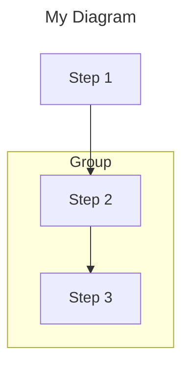

# Mermaid Diagram: Create, Convert, and View

## Overview

Create `.mmd` (Mermaid) diagrams, convert them to `.svg`, and open for viewing.

## Step 1: Create the .mmd file

Write Mermaid syntax to a `.mmd` file. Common diagram types:

- `flowchart TD` — top-down flow
- `flowchart LR` — left-right flow
- `graph TD` — directed graph
- `sequenceDiagram` — sequence diagram

Example structure:


## Step 2: Convert .mmd → .svg

```bash
mmdc -i <file>.mmd -o <file>.svg -b white --puppeteerConfigFile <(echo '{"executablePath":"/Users/schenam/.cache/puppeteer/chrome/mac_arm-148.0.7778.97/chrome-mac-arm64/Google Chrome for Testing.app/Contents/MacOS/Google Chrome for Testing"}')
```

### Notes
- `mmdc` is installed at `/opt/homebrew/bin/mmdc`
- `-b white` sets a white background (use `-b transparent` for transparent)
- The `--puppeteerConfigFile` with process substitution is required because mmdc's bundled puppeteer can't find Chrome without it
- Output format is inferred from extension (`.svg`, `.png`, `.pdf`)

## Step 3: Open the .svg

```bash
open <file>.svg
```

Opens in the default browser. SVGs are infinitely zoomable.

## Full One-Liner

```bash
mmdc -i <file>.mmd -o <file>.svg -b white --puppeteerConfigFile <(echo '{"executablePath":"/Users/schenam/.cache/puppeteer/chrome/mac_arm-148.0.7778.97/chrome-mac-arm64/Google Chrome for Testing.app/Contents/MacOS/Google Chrome for Testing"}') && open <file>.svg
```

## Styling Tips

```mermaid
classDef asyncIO fill:#ff9999,stroke:#cc0000,color:#000
classDef syncStep fill:#99ccff,stroke:#0066cc,color:#000
class NODE_A,NODE_B asyncIO
```

- Use `subgraph` to group related nodes
- Use `classDef` + `class` for color coding
- Use `<br/>` for line breaks in node labels
- Use `━` (box-drawing char) for visual separators in labels
